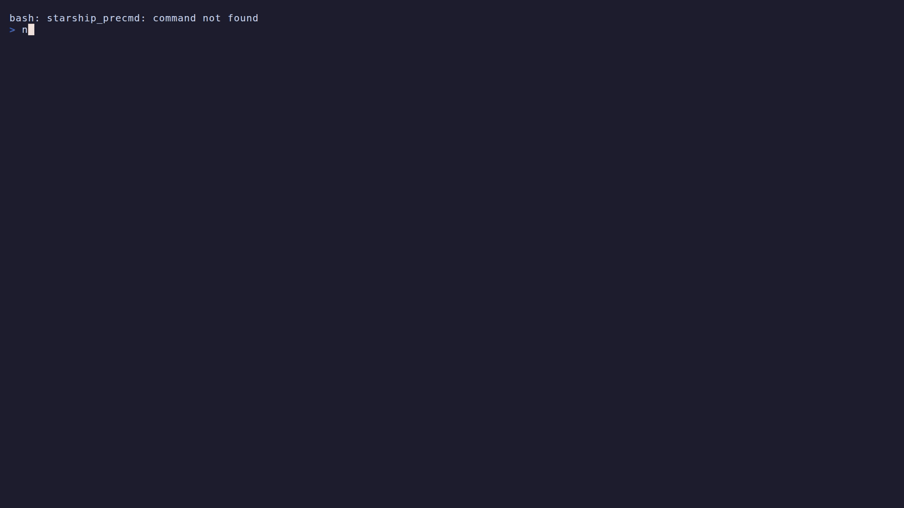

# pi.nvim



This is an opinionated Neovim UI plugin for [pi coding agent](https://github.com/badlogic/pi-mono/tree/main/packages/coding-agent), inspired by the Codex app.

It is mostly AI-generated and actively evolving.

## Features

- Session sidebar with pin/delete/rename/switch
- Chat view with live streaming (text, thinking, and tool calls)
- Tool navigation mode (`gt`, then `j/k`) with actions:
  - `<CR>` expand/collapse selected tool result
  - `o` open file from selected tool call
  - `d` open edit diffs or bash terminal output in the right panel
- Persistent right-side changes panel and diff viewer
- Markdown rendering for assistant messages
- Multi-line input bar with `@` file completion
- Clipboard image insertion in input (`<C-v>`) with attachment markers
- Local command palette (`?` in chat, `<C-p>` in input)

## Requirements

- Neovim `>= 0.9`
- `pi` on `PATH`
  - Install: `npm install -g @mariozechner/pi-coding-agent`
- pi authentication configured (`/login` in pi, or provider API key env vars)

## Setup From Scratch

1. Add `pi.nvim` to your `lazy.nvim` plugin list (GitHub source):

```lua
{
  "erkamkavak/pi.nvim",
  -- Optional: pin to a branch/tag/commit
  -- branch = "main",
  -- tag = "v0.1.0",
  -- commit = "abcdef123456",
  cmd = {
    "PiStart",
    "PiStop",
    "PiSessions",
    "PiChanges",
    "PiPrompt",
    "PiStatus",
    "PiChat",
    "PiNewSession",
  },
  keys = {
    { "<leader>ps", function() require("pi").toggle_sessions() end, desc = "pi: toggle sessions" },
    { "<leader>pc", function() require("pi").toggle_changes() end, desc = "pi: toggle changes" },
  },
  opts = {},
}
```

2. Reload/sync plugins:

```vim
:Lazy sync
```

3. Open pi:

```vim
:PiSessions
```

You can also use the keymap `<leader>ps`.

3. Enhanced Diff Highlighting

`pi.nvim` can use Pierre's diff renderer for richer syntax highlighting in the
changes panel. To enable it, turn on `diff_highlight.enabled` and set
`diff_highlight.install` to `"auto"` so the plugin prepares the highlighter the
first time it is needed. Use `"prompt"` if you prefer to approve that setup
inside Neovim.

## Commands

| Command | Description |
|---|---|
| `:PiStart` | Start pi RPC process |
| `:PiStop` | Stop pi RPC process |
| `:PiSessions` | Toggle sidebar + chat UI |
| `:PiChat` | Focus/open chat window |
| `:PiChanges` | Toggle right changes panel |
| `:PiPrompt <msg>` | Send prompt |
| `:PiStatus` | Show runtime/model/session status |
| `:PiNewSession` | Start a new pi session |
| `:PiThinkingLevel` | Select reasoning/thinking level |

## Default Keymaps

Global:
- `toggle_sessions`: `<leader>ps`
- `chat_command_palette`: `?`
- `chat_command_palette_insert`: `<C-p>`

Sidebar:
- `<CR>` select/switch session
- `P` pin/unpin
- `d` delete session
- `r` rename session
- `q` close pi UI

Chat:
- `i` focus input
- `gt` toggle tool navigation
- `j` next tool call
- `k` previous tool call
- `<CR>` expand/collapse selected tool result
- `o` open tool file
- `d` open tool side panel (diff for edits, terminal for bash)
- `q` close pi UI

Input:
- `<CR>` send message
- `<S-CR>` insert newline
- `<C-j>` leave input and return to chat
- `<C-v>` paste image from clipboard (falls back to text paste when no image is available)

## Configuration

```lua
require("pi").setup({
  pi_cmd = "pi",
  sidebar_width = 35,
  changes_width = 50,
  changes_open_by_default = false,
  diff_highlight = {
    enabled = true,
    install = "never", -- "never" | "prompt" | "auto"
  },
  auto_start = false,
  pinned_file = nil, -- default: stdpath("data") .. "/pi/pinned_sessions.json"
  session_dir = nil, -- default: ~/.pi/agent/sessions/<encoded-cwd>
  chat_max_messages = 150,
  chat_max_chars_per_message = 4000,
  input_height = 1,
  rpc_timeout_ms = 30000,
  ui_margin_cols = 2,
  ui_margin_rows = 1,
  keymaps = {
    toggle_sessions = "<leader>ps",
    chat_command_palette = "?",
    chat_command_palette_insert = "<C-p>",
    sidebar_select = "<CR>",
    sidebar_toggle_pin = "P",
    sidebar_delete = "d",
    sidebar_rename = "r",
    changes_toggle = "<C-c>",
    chat_tool_nav_toggle = "gt",
    chat_tool_next = "j",
    chat_tool_prev = "k",
    chat_tool_open_file = "o",
    chat_tool_open_diff = "d", -- diff for edits, terminal for bash
    prompt_send = "<CR>",
    prompt_follow_up = "<M-CR>",
    prompt_exit_input = "<C-j>",
    prompt_abort = "<C-d>",
  },
})
```

## Session Scope

By default, `pi.nvim` reads sessions for the current working directory only:

- `~/.pi/agent/sessions/<encoded-cwd>`

This keeps loading fast and avoids cross-project session noise. Use `session_dir` to override.
